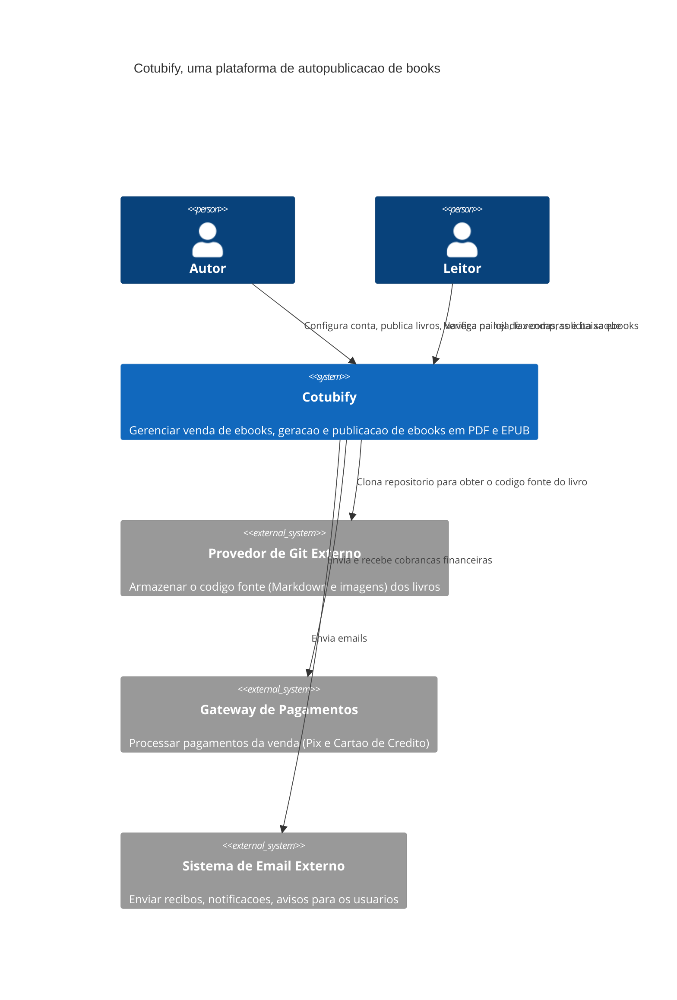
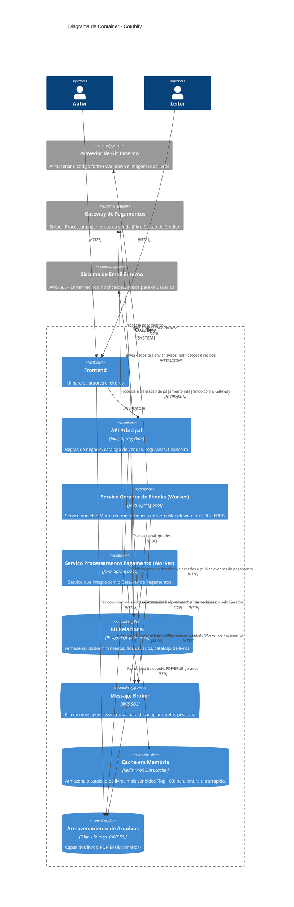
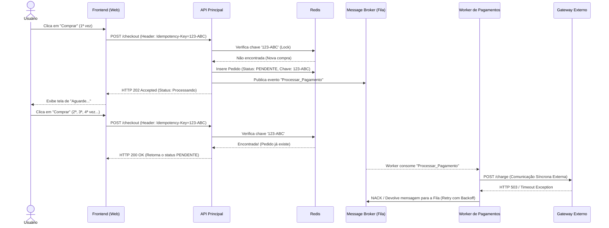

# Arquitetura Cotubify

O Cotubify eh uma plataforma de autopublicacao e venda de ebooks.

O sistema permite autores tecnicos conectarem repositorio Git com arquivos no formato Markdown para geracao automatizada de ebooks nos formatos PDF e EPUB. Os autores tambem tem um painel de vendas.

Permite tambem que os leitores acessem uma loja online para navegacao, compra e download das obras. Os leitores recebem recibos e notificacoes via email.

## Diagrama do Contexto (C4 Model)

## Diagrama de Containers (C4 Model)

## Decisoes Arquiteturais (ADRs)

- [ADR 001: Geracao de ebooks via Mensageria Assincrona](adr/adr-001-geracao-ebooks-assincrona.md)
- [ADR 002: Introdução de Cache em Memória para o Catálogo de E-books](adr/adr-002-cache-catalogo.md)
- [ADR 003: Resiliência e Idempotência para o Fluxo de Pagamentos](adr/adr-003-resiliencia-pagamentos.md)

## Diagrama de Sequência

